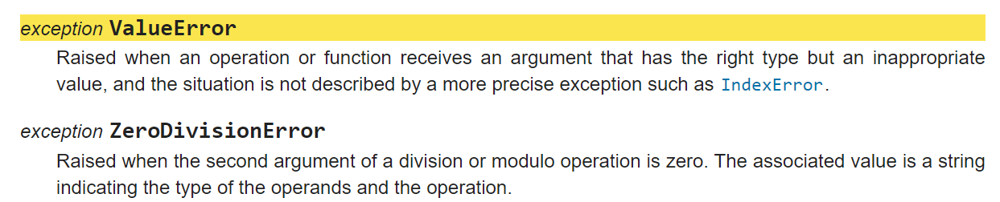
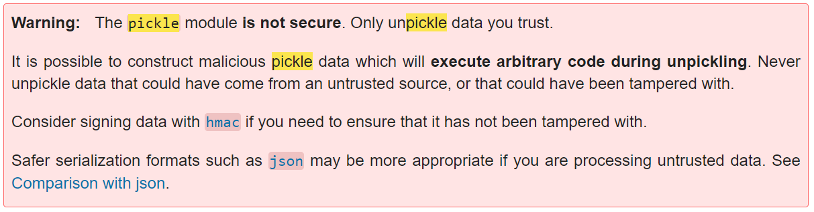
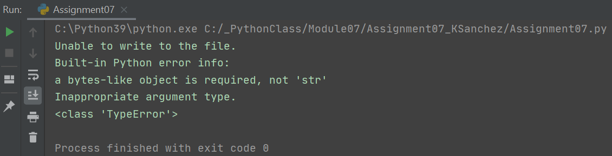
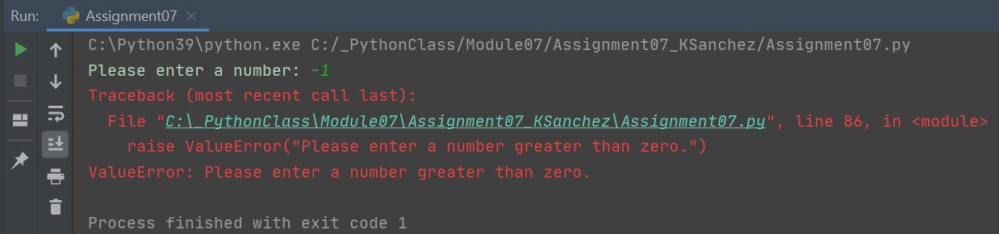
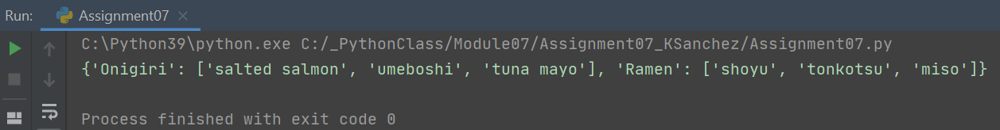
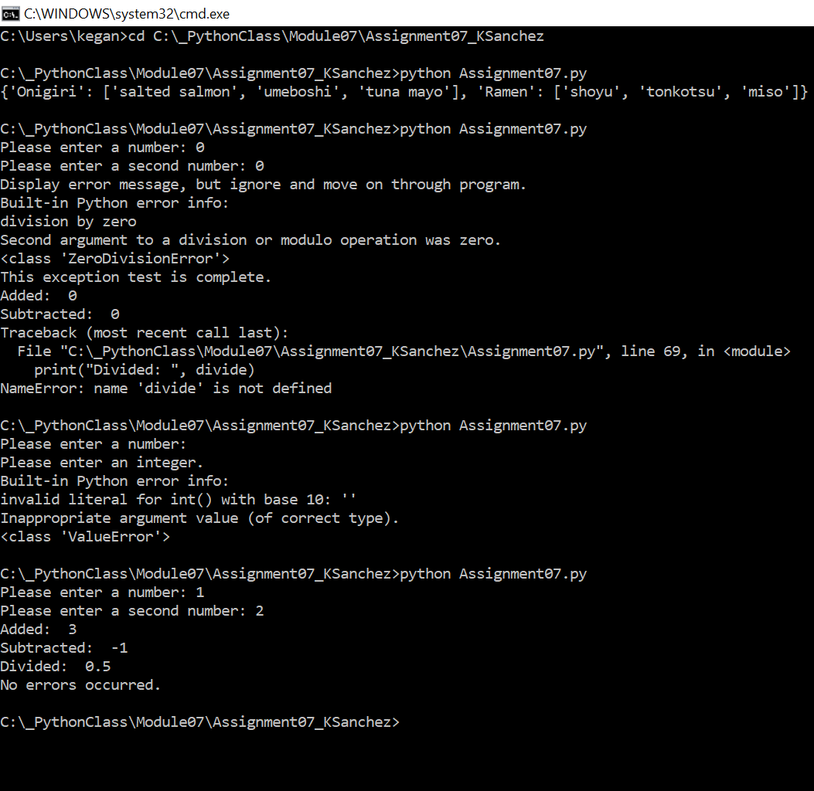
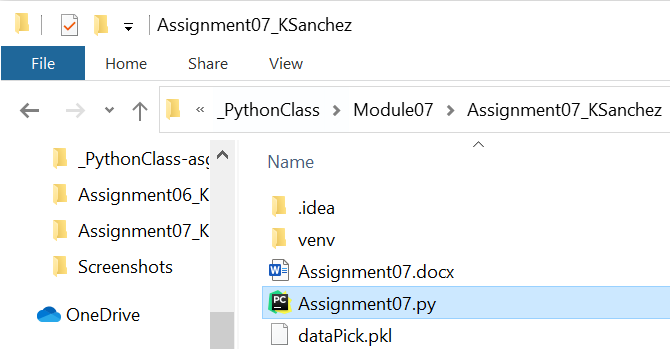

# Exception Handling and Pickling
KSanchez, 12.1.2020

## Introduction
This week, I created a program that demonstrates exception handling and pickling. 
This assignment included new components such as using the try, except, else, pass and finally blocks as well as the pickle module.

## Researching the Program
In addition to reviewing the module notes provided by the instructor, Randal Root, 
I began by researching the topics I would need to incorporate within this program, starting with exception handling and then moving on to pickling.

### Exception Handling in Python
My first task was to research exception handling in Python, and I found a few good sources of information. 

#### W3Schools

The first source was from a site that many of the course links came from, w3schools.com. The site explained the Python try block which “let’s you test a block of code for errors,” the except block which “lets you handle the error,” and the finally block which “ lets you execute code, regardless of the result of the try- and except blocks.” (w3schools, https://www.w3schools.com/python/python_try_except.asp, 2020) (External Site).  
The site went on to explain that when errors (or exceptions) occur, Python normally stops and generates an error message. Using a try statement will raise an error that can execute one or many except blocks. Using the else keyword “[defines] a block of code to be executed if no errors were raised.” And using a finally block “will be executed regardless if the try block raises an error or not” which “can be useful to close objects and clean up resources.”
Raising an exception was the last topic covered on this page. Using the raise keyword will throw (or raise) an exception, which can help with handling specific types of errors.

#### YouTube – Trevor Payne
The second source I found was also from a page previously included in the course links, a YouTube video by Trevor Payne. The video was called “Let's Learn Python - Basics #5 of 8 - Exception Handling” and focused on using exception handling to prevent scripts from breaking due to user input. (YouTube, https://www.youtube.com/watch?v=hrR0WrQMhSs&list=PL82YdDfxhWsDJTq5f0Ae7M7yGcA26wevJ&index=5, 2020) (External Site).
Trevor Payne explains the try statement as trying to execute code and the except statement as catching all or just specific errors. He does a great job of explaining how exception handling helps to catch multiple types of errors while displaying messages that can be helpful for end users or with debugging.
Another keyword he covers is pass, which signals to the program to ignore and move on. This keyword has been covered in previous modules and can be used in for and while loops as well as within try/except blocks. Trevor also covered using the raise keyword which he noted is used to force a specific error or exception to be called.
The last keyword he covers is finally, which is a block with the last actions to perform after try-except. This block always happens at the end and occurs before any real errors are returned.

#### The Python Standard Library

The last source I reviewed was the Built-In Exceptions page in the Python Standard Library. (Python Standard Library, https://docs.python.org/3/library/exceptions.html#bltin-exceptions, 2020) (External Site). 
It describes exceptions in high-level terms, but lists all built-in exceptions that can be used for specific error handling (Figure 1).


##### Figure 1. Python Built-In Exception Descriptions

### Pickling
After exception handling, the next topic I researched was pickling. I found less sources on this topic, but the ones I did find provided a good overview of the topic.

#### YouTube – Mark Jay
The first source I found was a video on YouTube by Mark Jay (YouTube, https://www.youtube.com/watch?v=Pl4Hp8qwwes, 2020). In his video, Mark Jay describes pickling as “taking your Python object like your dictionary, your list… and saving it to a serialized file format so then when you’re ready at a later time, you can unpickle it and quickly get your Python object back.” He noted that pickling is useful for data that’s not in an ideal format which you unzip, clean, and parse into a final form, such as a Python dictionary, and then save to a pickle file to later read and analyze.
Mark demonstrated importing the pickle module, opening a file to write binary data, reading a file’s binary data, and saving that data in an object and said that when working with files, the with statement is useful for handling opening and closing automatically.
He ends his video by noting that pickling is useful when you’ve read some data, cleaned it, and unpacked it, and that once this is done, you can pickle it and use it later down the road.

#### The Python Standard Library

As always, going to the original source is good for reference material and to get an overview of what’s available, which is why I also took a look at The Python Standard Library page on the pickle module (The Python Standard Library, https://docs.python.org/3/library/pickle.html?highlight=pickle#module-pickle, 2020)(External Site).
In his YouTube video, Mark Jay calls attention to the Python Standard Library page for pickling when he notes that it’s possible to pickle a harmful virus and to become vulnerable to an attack if you unpickle data from an untrusted or unauthenticated source (Figure 2). As a guideline, he suggests only pickling data that you generate or which you’re certain was generated safely.


##### Figure 2: Python Standard Library - Pickle Module Warning

## Creating the Program

Once my research was complete, I started my demo program by creating a new project in PyCharm that uses my Assignment07 folder and adding an assignment file to my project. I included a header and started adding code to demonstrate the topics I had researched.

### Exception Handling Demos
#### Try-Except
I first wanted to demonstrate exception handling, so I created a try-except block with multiple except statements handling different types of errors. The easiest way I could test different errors was if I performed mathematical operations and received user input that these operations may not expect. 
I created two variables that would each store a number provided by the user, and then added, subtracted, and divided these variables. If the user provided the number 0 for y, the second user variable, I handled this ZeroDivisionError with an except statement that stored the error in a variable to use in a message (as shown in the course module notes), and displayed helpful messages to the user and for debugging. I then added two additional except cases – one that handled a ValueError if the user provided a string or simply hit the space/enter key, and one that handled everything else (Figure 3).

```
# ----- Try-Except:
try:  # Tests the following code block for errors
    x = int(input("Please enter a number: "))
    y = int(input("Please enter a second number: "))
    add = x + y
    subtract = x - y
    divide = x/y

except ZeroDivisionError as e:  # Handles a ZeroDivisionError if user enter 0 for y
    print("Variable y cannot be a zero.")
    print("Built-in Python error info:")
    print(e, e.__doc__, type(e), sep='\n')
except ValueError as e:  # Handles a ValueError if user input is a string or space/enter key
    print("Please enter an integer.")
    print("Built-in Python error info:")
    print(e, e.__doc__, type(e), sep='\n')
except Exception as e:  # Handles all other error types and provides details
    print("Something else went wrong.")
    print("Built-in Python error info:")
    print(e, e.__doc__, type(e), sep='\n')task
```
##### Figure 3: Exception Handling – Error Types 

#### Else
To demonstrate the else keyword, I started with code from the previous demo and added an else statement at the end to display the results of my mathematical operations and a message communicating that no errors had occurred. (Figure 4).
```
# ----- Else:
try:  # Tests the following code block for errors
    x = int(input("Please enter a number: "))
    y = int(input("Please enter a second number: "))
    add = x + y
    subtract = x - y
    divide = x/y

except Exception as e:  # Handles all error types and provides details
    print("Something else went wrong.")
    print("Built-in Python error info:")
    print(e, e.__doc__, type(e), sep='\n')
else:  # Displays results and message if user input does not generate an error
    print("Added: ", add)
    print("Subtracted: ", subtract)
    print("Divided: ", divide)
    print("No errors occurred.")
```
##### Figure 4: Exception Handling – Else 

#### Pass and Finally
With pass and finally, I once again began with code from the previous two demos, but include a pass at the end of the exception block and a finally at the end of the entire try-except. Finally, I moved the code that displayed my mathematical operations to the end of the program to show that it would still execute after errors with the pass keyword present (Figure 5). 
````
# ----- Pass and Finally:
try:  # Tests the following code block for errors
    x = int(input("Please enter a number: "))
    y = int(input("Please enter a second number: "))
    add = x + y
    subtract = x - y
    divide = x/y

except Exception as e:  # Handles all error types and provides details, but continues program
    print("Display error message, but ignore and move on through program.")
    print("Built-in Python error info:")
    print(e, e.__doc__, type(e), sep='\n')
    pass  # Tells program to ignore error and continue through program
finally:  # Performs actions after all try-except actions
    print("This exception test is complete.")

# The program reaches this block, even if errors occur
print("Added: ", add)
print("Subtracted: ", subtract)
print("Divided: ", divide)
````
##### Figure 5: Exception Handling – Pass and Finally

#### Handling a File
I thought it was important to include a demonstration of handling a file with the finally keyword, which W3Schools mentioned was useful for closing objects and cleaning up resources. I started with a try block that opens a file to write in binary data and attempted to write a string to it. This generates a TypeError because a bytes-like object is required, so the error is handled in the except block and the finally block closes the file object and continues the program (Figure 6).
```
# ----- Handling a file:
try:
    objFile = open("file.txt", "wb")
    objFile.write("Test") # Generates a TypeError because a bytes-like object is required
except Exception as e:
    print("Unable to write to the file.")
    print("Built-in Python error info:")
    print(e, e.__doc__, type(e), sep='\n')
finally:
    objFile.close()  # Closes the file object and continues the program
````
##### Figure 6: Exception Handling – Handling a File

When I tested this block in PyCharm, I saw my error message and the built-in Python error info that I had saved and printed (Figure 7).



##### Figure 7: Exception Handling – Handling a File Test

#### Raising an Error
The final exception handling demonstration involved showing how to raise an error. I kept this last demo simple by requesting one variable from the user and raising two errors if the number they provided was less than zero, a ValueError, or equal to zero, a ZeroDivisionError (Figure 8).
```
# ----- Raising an Error:
x = int(input("Please enter a number: "))

if x < 0:  # Raises an error if the user enters a negative number
    raise ValueError("Please enter a number greater than zero.")
elif x == 0:  # Raises an error if the user enters a zero
    raise ZeroDivisionError("Please do not enter a zero.") 
```
##### Figure 8: Exception Handling – Raising an Error

When I tested this code, I provided a 0 and a -1, and received each error that I had specified (Figure 9).
Pickling Demo

##### Figure 9: Exception Handling – Raising an Error Test

### Pickling Demo
To demonstrate pickling,  I combined code for both writing and reading binary data to/from a file. First, I imported the pickle module, created a dictionary, and filled the dictionary with keys and values. I then used the with keyword with the open() function and passed in a file name and the wb mode for writing binary files. I then specified the binary object name as pickleFile. Once the file was open, I used the pickle.dump() function and passed in the dictionary object and pickle file object. This wrote binary data to the file.
Next, I used the with keyword and the open() function again, passed in the file name and rb mode for reading binary data, and specified the file object as pickleFile again. Finally, I loaded the data from the file object with pickle.load(), passed in the file object, and printed the data to show that what had been written could now be read (Figure 10).
```
# ----- Writing to a File:
import pickle
pickleDict = {}

pickleDict["Onigiri"] = ["salted salmon", "umeboshi", "tuna mayo"]
pickleDict["Ramen"] = ["shoyu", "tonkotsu", "miso"]

with open('dataPick.pkl', 'wb') as pickleFile: # Opens a file for writing binary data and specifies the binary object
    pickle.dump(pickleDict, pickleFile) # Writes data to new file specifying data and file object

# ----- Reading a File:

with open('dataPick.pkl', 'rb') as pickleFile:  # Opens a file for reading binary data
    newData = pickle.load(pickleFile) # Loads data from file object and stores
    print(newData)  # Prints all the loaded data
```
##### Figure 10: Pickling – Writing and Reading Binary Data to a File 

I tested this demo code in PyCharm and saw that all of my dictionary data displayed (Figure 11).


##### Figure 11: Pickling – Writing and Reading Binary Data to a File Test

## Testing
When I began creating this program, I completed all coding and testing primarily in the PyCharm IDE, as shown in some of the previous demo sections. To complete this assignment, I also tested in the command terminal.

### Command Terminal
I opened a command terminal, changed the directory to my assignment folder, and ran portions of my Assignment07.py script file. I received the desired output here, as well (Figure 12).


##### Figure 12: Command Terminal Testing

Finally, I checked that the text document was saved in my assignment folder (Figure 13).


##### Figure 13: Verifying Data File Exists

## Summary
After creating the demo code to show how exception handling and pickling work, I reflected on what I had learned. I not only gained experience in how to do my own research on specific topics, but also how to then show examples of how these topics are used. It makes more sense to me now when people say that to learn a subject well you have to teach it to someone else. I will keep this in mind for future projects and continue looking for ways to enhance my ability to learn and apply new concepts.
